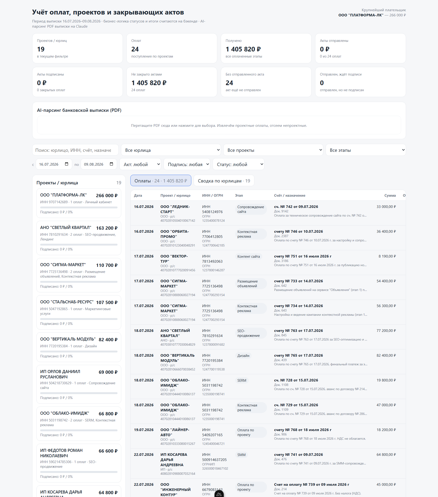

# Учёт оплат, проектов и закрывающих актов

Мини-система для digital-агентства: дашборд поступлений по проектам и контроль закрывающих актов
(отправлен / подписан / требует внимания), плюс **AI-пайплайн распознавания PDF банковской выписки**
на Claude — `PDF → структурированный JSON → БД`, с валидацией и отсевом непроектных операций.

Стек: **Nuxt 3 (Vue 3 + TypeScript, Nitro server API)** · **Drizzle ORM + Postgres (Neon)** ·
**Anthropic SDK** · **Zod** · **Vitest**. Деплой на Vercel, сквозные TS-типы данные → логика → вид.

---

## Демо

**Живой деплой:** https://payments-dashboard-theta.vercel.app/



Сводка по поступлениям и закрывающим актам, фильтры (юрлицо, проект, этап, статус акта, период),
список проектов и таблица оплат со статусами актов. Данные — из Postgres (Neon): 24 оплаты / 19 юрлиц.

---

## Быстрый старт

```bash
pnpm install
cp .env.example .env          # впишите DATABASE_URL (Neon). Ключ Anthropic не обязателен — без него MockExtractor
pnpm db:push                  # накатить схему в Postgres (drizzle-kit push)
pnpm db:seed                  # засеять golden-fixture (24 оплаты, 19 юрлиц)
pnpm dev                      # http://localhost:3000
pnpm test                     # Vitest: actStatus и aggregate (эталонные числа)
```

> БД — **Postgres (Neon)**: одна и та же база локально и в проде; бесплатный проект на neon.tech даёт
> `DATABASE_URL`. Подключение — `postgres-js` ([`db/index.ts`](db/index.ts)), идемпотентный seed —
> [`db/seed.ts`](db/seed.ts).

## Что внутри

- **Дашборд:** сводка-итоги, фильтры (юрлицо / проект / этап / статус акта / период / поиск), список
  проектов, таблица оплат. Статус акта — 4 состояния: не отправлен / ждёт подпись / закрыт / требует внимания.
- **Бизнес-логика — чистые функции** ([`server/domain/`](server/domain/)), покрытые юнит-тестами; все
  итоги и фильтрация считаются **на бэкенде** — фронт ничего не пересчитывает.
- **AI-ingest** ([`POST /api/ingest`](server/api/ingest.post.ts)): `unpdf → Claude tool-use (Zod-схема) →
  классификация → отсев непроектных операций → идемпотентный upsert`. Без `ANTHROPIC_API_KEY` работает
  `MockExtractor`, поэтому демо и CI зелёные без ключа.
- **Идемпотентность** по натуральному ключу `sha1(дата | ИНН | док | сумма)` — повторная загрузка PDF
  делает upsert, а не плодит дубли.

## Архитектура (слои)

```
db/        schema.ts (4 таблицы) · fixture.ts (24 записи) · seed.ts · migrate.ts
server/
  domain/    actStatus.ts · aggregate.ts · naturalKey.ts   ← чистая логика, юнит-тесты
  services/  payments.ts · acts.ts · ingest.ts             ← оркестрация поверх Drizzle
  ai/        schema.ts · pdf.ts · claude.ts · mock.ts · extractor.ts
  api/       payments/projects/summary/filter-options (GET) · acts/[id] (PATCH) · ingest (POST)
app/       composables/useDashboard.ts · components/* · pages/index.vue   ← Vue 3
```

## Деплой (Vercel + Neon)

Vercel определяет Nuxt-preset автоматически. Env: `DATABASE_URL` (Neon), `AI_MODEL`, `NOW`,
`ATTENTION_DAYS`, опц. `ANTHROPIC_API_KEY`. Схему и seed на прод-БД накатить один раз:
`pnpm db:push && pnpm db:seed` (с прод `DATABASE_URL`).

---

> **Подробности реализации** — схема данных и ER, логика статусов, AI-пайплайн, REST API, принятые
> решения и масштабирование (embeddings/RAG) — в [docs/IMPLEMENTATION.md](docs/IMPLEMENTATION.md).
